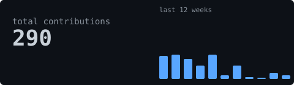
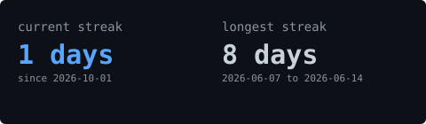
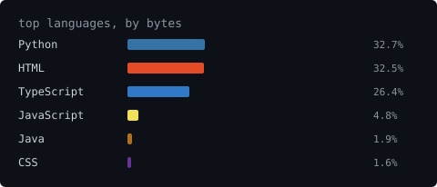

<picture>
  
</picture>

 

<samp>Vannsh Shah · building things</samp>

  

 

<blockquote>generated by a GitHub Action in this repo — no third-party widgets</blockquote>

[LinkedIn](https://www.linkedin.com/in/vannsh-shah-67271a309) · [GitHub](https://github.com/shahvannsh) · [Portfolio](https://portfolio-mu-ruby-37.vercel.app/) · [Chotu (live)](https://chotu-a-personalassitant-production.up.railway.app)

## Projects

| Project | What it is | Link |
|---|---|---|
| **Chotu** | Iron-Man-inspired academic AI assistant with focus sessions, a roast mode, a distraction-free study mode and session history. Mar 2026 – present. | [Live](https://chotu-a-personalassitant-production.up.railway.app) |
| **JobSwipe** | Swipe-based job matching app for students and job seekers, built with C++ and QML. Jan 2025 – present. | n/a |
| **RL-Documentation-Parser** | Gymnasium reinforcement-learning environment where an agent navigates a mock file system to answer questions from technical docs. Meta Hackathon, Feb – Apr 2026. | n/a |
